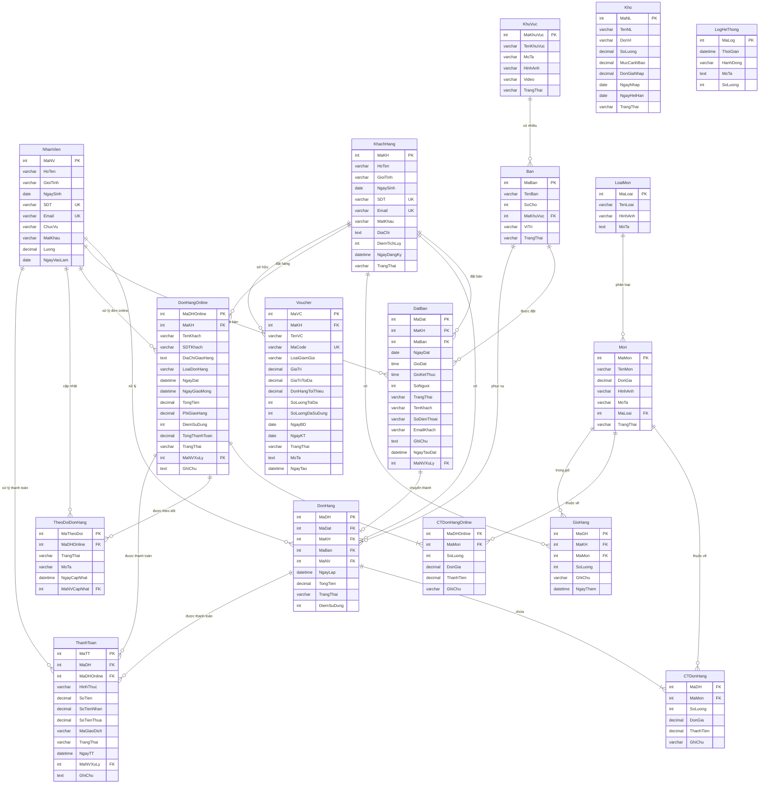
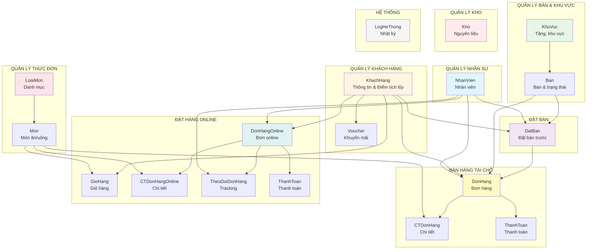

# Biểu Đồ Cơ Sở Dữ Liệu - Quán Cà Phê

## Entity Relationship Diagram (ERD)



## Sơ Đồ Phân Nhóm Chức Năng



## Mô Tả Chi Tiết Các Bảng

### 1. **Quản Lý Nhân Sự**

#### NhanVien (Nhân viên)
- **Mục đích**: Lưu thông tin nhân viên, phân quyền
- **Chức vụ**: Quản lý, Nhân viên
- **Liên kết**: Xử lý đơn hàng, đặt bàn, thanh toán

---

### 2. **Quản Lý Khách Hàng**

#### KhachHang (Khách hàng)
- **Mục đích**: Quản lý thông tin khách hàng
- **Tính năng**: Điểm tích lũy (1 điểm = 1,000 VNĐ)
- **Trạng thái**: Hoạt động, Tạm khóa

#### Voucher (Khuyến mãi)
- **Loại giảm giá**: Tiền, Phần trăm
- **Áp dụng**: Cho khách hàng cụ thể hoặc tất cả
- **Điều kiện**: Đơn hàng tối thiểu, giá trị tối đa

---

### 3. **Quản Lý Bàn & Khu Vực**

#### KhuVuc (Khu vực)
- **Mục đích**: Phân chia không gian quán
- **Hỗ trợ**: Hình ảnh, video giới thiệu
- **Ví dụ**: Tầng 1, Tầng 2, VIP, Sân thượng

#### Ban (Bàn)
- **Thông tin**: Tên, số chỗ, vị trí
- **Trạng thái**: Trống, Đã đặt, Đang phục vụ, Bảo trì

---

### 4. **Quản Lý Thực Đơn**

#### LoaiMon (Loại món)
- **Mục đích**: Phân loại thực đơn
- **Ví dụ**: Cà phê, Trà, Nước ép, Bánh ngọt

#### Mon (Món)
- **Thông tin**: Tên, giá, hình ảnh, mô tả
- **Trạng thái**: Còn bán, Hết hàng

---

### 5. **Đặt Bàn**

#### DatBan (Đặt bàn)
- **Thông tin**: Khách hàng, bàn, thời gian
- **Giờ đặt**: GioDat (bắt đầu), GioKetThuc (kết thúc)
- **Trạng thái**: Đã đặt, Đã xác nhận, Đã hủy, Hoàn thành
- **Tự động hủy**: Quá giờ đặt + 30 phút

---

### 6. **Bán Hàng Tại Chỗ**

#### DonHang (Đơn hàng)
- **Nguồn gốc**: Từ đặt bàn hoặc walk-in
- **Liên kết**: Khách hàng (cộng điểm), nhân viên, bàn
- **Sử dụng điểm**: 1 điểm = 1,000 VNĐ giảm giá
- **Trạng thái**: Chờ thanh toán, Hoàn thành, Đã hủy

#### CTDonHang (Chi tiết đơn hàng)
- **Thông tin**: Món, số lượng, đơn giá, thành tiền
- **Ghi chú**: Yêu cầu đặc biệt (ít đá, thêm đường...)

---

### 7. **Đặt Hàng Online**

#### GioHang (Giỏ hàng)
- **Mục đích**: Lưu tạm món chọn
- **Đặc điểm**: 1 khách - 1 món (unique)

#### DonHangOnline (Đơn hàng online)
- **Loại**: Giao hàng, Mang đi
- **Chi phí**: Tổng tiền + phí giao hàng - điểm tích lũy
- **Trạng thái**: Chờ xác nhận → Đã xác nhận → Đang chuẩn bị → Đang giao → Hoàn thành
- **Hủy**: Có lý do hủy

#### CTDonHangOnline (Chi tiết)
- **Tương tự**: CTDonHang
- **Ghi chú**: Yêu cầu đặc biệt

#### TheoDoiDonHang (Tracking)
- **Mục đích**: Lịch sử thay đổi trạng thái
- **Thông tin**: Trạng thái, mô tả, nhân viên, thời gian

---

### 8. **Thanh Toán**

#### ThanhToan (Thanh toán)
- **Hình thức**: Tiền mặt, Thẻ, Ví điện tử, Chuyển khoản
- **Áp dụng**: Đơn hàng tại chỗ hoặc online
- **Chi tiết**: Số tiền nhận, tiền thừa, mã giao dịch
- **Trạng thái**: Thành công, Thất bại, Chờ xử lý

---

### 9. **Quản Lý Kho**

#### Kho (Nguyên liệu)
- **Thông tin**: Tên, đơn vị, số lượng
- **Cảnh báo**: Mức cảnh báo tồn kho
- **Chi phí**: Đơn giá nhập, ngày nhập
- **Hạn sử dụng**: Ngày hết hạn
- **Trạng thái**: Còn hàng, Hết hàng, Gần hết

---

### 10. **Hệ Thống**

#### LogHeThong (Nhật ký)
- **Mục đích**: Ghi log các hành động tự động
- **Ví dụ**: 
  - AUTO_CANCEL_RESERVATIONS (hủy đặt bàn quá hạn)
  - AUTO_RESET_TABLES (reset bàn cuối ngày)

---

## Stored Procedures & Functions

### 🔄 **Tự Động Hủy Đặt Bàn**
1. `TuDongHuyDonDatBanQuaHan()` - Hủy đơn quá giờ + 30 phút
2. `KiemTraDonSapHetHan(p_SoPhutCanhBao)` - Cảnh báo sắp hết hạn
3. `BaoCaoDonDatBanBiHuy(p_NgayBatDau, p_NgayKetThuc)` - Báo cáo hủy
4. `TinhThoiGianConLai(p_NgayDat, p_GioDat)` - Tính thời gian còn lại
5. **EVENT**: `AutoCancelExpiredReservations` - Chạy mỗi 30 phút

### 🔄 **Tự Động Reset Bàn**
6. `TuDongResetBanLucCuoiNgay()` - Reset tất cả bàn cuối ngày
7. `TuDongResetBanThongMinh()` - Reset bàn (trừ có đặt trước)
8. `KiemTraBanCoTheReset(p_MaBan)` - Kiểm tra điều kiện reset
9. `BaoCaoResetBanTheoNgay(p_NgayBatDau, p_NgayKetThuc)` - Báo cáo reset
10. **EVENT**: `AutoResetTablesAt10PM` - Chạy lúc 22h hàng ngày

### 📊 **Phân Tích Doanh Thu**
11. `TinhTongDoanhThu()` - Tổng doanh thu
12. `DoanhThuTheoKhoangThoiGian(p_NgayBatDau, p_NgayKetThuc)` - Theo ngày
13. `DoanhThuTheoMon(p_NgayBatDau, p_NgayKetThuc)` - Theo món
14. `XepHangMonBanChay(p_NgayBatDau, p_NgayKetThuc, p_SoLuong)` - Top món
15. `DoanhThuTheoDanhMuc(p_NgayBatDau, p_NgayKetThuc)` - Theo danh mục
16. `DoanhThuTheoGio(p_NgayBatDau, p_NgayKetThuc)` - Theo giờ
17. `DoanhThuTheoNhanVien(p_NgayBatDau, p_NgayKetThuc)` - Theo nhân viên
18. `DoanhThuTheoHinhThucThanhToan(p_NgayBatDau, p_NgayKetThuc)` - Theo hình thức

### ✅ **Kiểm Tra & Validate**
19. `KiemTraThongTinKhachHang(p_TenKhach, p_SoDienThoai, p_EmailKhach)` - Validate thông tin

---

## Business Rules

### 💎 **Hệ Thống Điểm Tích Lũy**
- **Tích điểm**: Mỗi 10,000 VNĐ = 1 điểm
- **Sử dụng**: 1 điểm = 1,000 VNĐ giảm giá
- **Áp dụng**: Cả đơn tại chỗ và online
- **Tự động cộng**: Khi đơn hàng hoàn thành

### 🎫 **Voucher Rules**
- **2 loại**: Giảm tiền cố định / Giảm phần trăm
- **Giới hạn**: Giá trị tối đa, đơn hàng tối thiểu
- **Số lượng**: Hạn mức sử dụng
- **Thời hạn**: Ngày bắt đầu - kết thúc

### 🪑 **Quản Lý Bàn**
- **Trạng thái**: Tự động cập nhật theo đơn đặt/đơn hàng
- **Tự động hủy**: Đặt bàn quá giờ + 30 phút
- **Reset**: Lúc 22h hàng ngày (nếu không có đặt trước)

### 📦 **Đơn Hàng**
- **Từ đặt bàn**: DatBan → DonHang (khi khách đến)
- **Walk-in**: Tạo DonHang trực tiếp
- **Tính tiền**: Tổng tiền - Điểm sử dụng + Phí giao (nếu online)

### 🚚 **Giao Hàng Online**
- **Trạng thái**: 6 bước theo dõi chi tiết
- **Lịch sử**: Mọi thay đổi đều ghi log
- **Tính phí**: Tự động tính tổng thanh toán

---

## Indexes & Performance

### Các Index Quan Trọng
```sql
-- Tìm kiếm nhanh
INDEX idx_mon_trangthai ON Mon(TrangThai)
INDEX idx_donhang_trangthai ON DonHang(TrangThai)
INDEX idx_datban_ngay ON DatBan(NgayDat, GioDat)

-- Join hiệu quả
INDEX idx_ctdonhang_madh ON CTDonHang(MaDH)
INDEX idx_ctdonhang_mamon ON CTDonHang(MaMon)

-- Log và tracking
INDEX idx_action_time ON LogHeThong(HanhDong, ThoiGian)
```

---

## Lưu Ý Kỹ Thuật

### Character Set
- **Charset**: utf8mb4_unicode_ci
- **Hỗ trợ**: Tiếng Việt đầy đủ, emoji

### Timestamps
- **Auto**: NgayLap, NgayTaoDat, NgayDangKy
- **Default**: CURRENT_TIMESTAMP

### Cascading
- **ON DELETE**: Không có CASCADE (bảo toàn dữ liệu)
- **Business Logic**: Xử lý ở application layer

### Security
- **Password**: Hashed với bcrypt
- **API**: Validation qua stored functions
- **Constraints**: Foreign keys đầy đủ

---

## Luồng Nghiệp Vụ Chính

### 🎯 **Luồng Đặt Bàn → Phục Vụ → Thanh Toán**
```
1. Khách đặt bàn → DatBan (TrangThai: Đã đặt)
2. Nhân viên xác nhận → DatBan (TrangThai: Đã xác nhận)
3. Khách đến → Tạo DonHang (liên kết MaDat)
4. Gọi món → Thêm CTDonHang
5. Thanh toán → Tạo ThanhToan
6. Hoàn thành → DonHang (TrangThai: Hoàn thành)
   - Tự động cộng điểm tích lũy cho khách hàng
   - Reset bàn về trống
```

### 🛒 **Luồng Đặt Hàng Online**
```
1. Khách chọn món → GioHang
2. Đặt hàng → DonHangOnline (TrangThai: Chờ xác nhận)
   - Copy từ GioHang → CTDonHangOnline
   - Xóa GioHang
3. Nhân viên xác nhận → TheoDoiDonHang
4. Chuẩn bị → TheoDoiDonHang
5. Giao hàng → TheoDoiDonHang
6. Hoàn thành → DonHangOnline (TrangThai: Hoàn thành)
   - Tự động cộng điểm tích lũy
7. Thanh toán → ThanhToan (nếu COD hoặc online payment)
```

---

## Tổng Kết

### 📊 Thống Kê Database
- **Tổng số bảng**: 17 bảng
- **Stored Procedures**: 15+ procedures
- **Functions**: 10+ functions
- **Events**: 2 scheduled events
- **Foreign Keys**: 20+ relationships

### 🎯 Tính Năng Chính
1. ✅ Quản lý nhân viên & phân quyền
2. ✅ Quản lý khách hàng & điểm tích lũy
3. ✅ Quản lý bàn theo khu vực
4. ✅ Thực đơn đa dạng
5. ✅ Đặt bàn trước
6. ✅ Bán hàng tại chỗ
7. ✅ Đặt hàng online & giao hàng
8. ✅ Giỏ hàng & checkout
9. ✅ Thanh toán đa hình thức
10. ✅ Voucher & khuyến mãi
11. ✅ Quản lý kho nguyên liệu
12. ✅ Báo cáo doanh thu chi tiết
13. ✅ Tự động hóa (hủy đặt bàn, reset bàn)

### 🚀 Điểm Mạnh
- **Hoàn chỉnh**: Đầy đủ tính năng quán cà phê
- **Tự động hóa**: Events & stored procedures
- **Phân tích**: Báo cáo doanh thu đa chiều
- **Linh hoạt**: Hỗ trợ cả tại chỗ và online
- **Hiệu quả**: Indexes tối ưu
- **An toàn**: Foreign keys & validation

