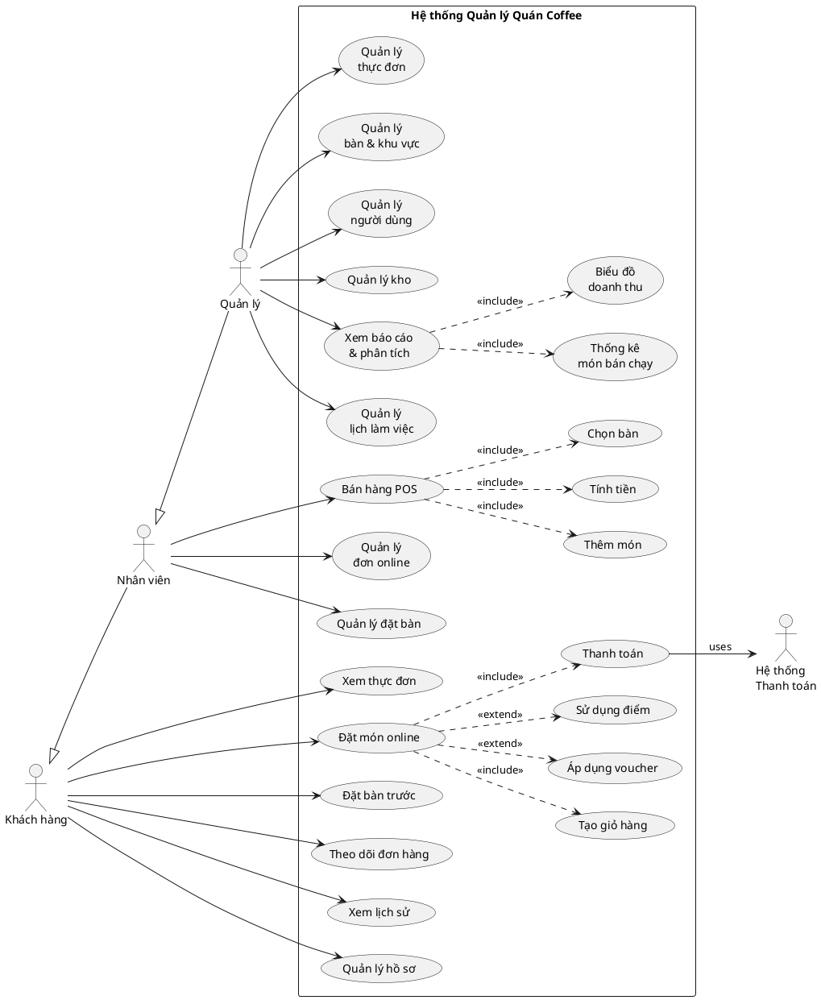

# USE CASE DIAGRAM - HỆ THỐNG QUẢN LÝ QUÁN COFFEE

## 1. ACTORS (Các Tác Nhân)

### 👤 Primary Actors
1. **Khách hàng (Customer)** - Người đặt món, đặt bàn
2. **Nhân viên (Staff)** - Phục vụ, bán hàng tại quầy
3. **Quản lý (Admin/Manager)** - Quản lý toàn bộ hệ thống

### 🤖 Secondary Actors
4. **Hệ thống thanh toán** - Xử lý thanh toán online
5. **Hệ thống thông báo** - Gửi email/SMS

---

## 2. USE CASES CHÍNH

### 🛒 KHÁCH HÀNG (Customer)
```
[Khách hàng]
    |
    |--- (UC01) Xem thực đơn
    |--- (UC02) Đặt món online
    |       |--- <<include>> Tạo giỏ hàng
    |       |--- <<include>> Nhập thông tin giao hàng
    |       |--- <<extend>> Áp dụng mã giảm giá
    |       |--- <<extend>> Sử dụng điểm tích lũy
    |       |--- <<include>> Thanh toán
    |
    |--- (UC03) Đặt bàn trước
    |       |--- <<include>> Chọn thời gian & số người
    |       |--- <<extend>> Ghi chú đặc biệt
    |
    |--- (UC04) Theo dõi đơn hàng
    |--- (UC05) Xem lịch sử đơn hàng
    |--- (UC06) Quản lý hồ sơ cá nhân
    |       |--- <<extend>> Xem điểm tích lũy
    |--- (UC07) Đăng nhập/Đăng ký
```

### 👨‍💼 NHÂN VIÊN (Staff)
```
[Nhân viên]
    |
    |--- (UC08) Bán hàng tại quầy (POS)
    |       |--- <<include>> Chọn bàn
    |       |--- <<include>> Thêm món vào đơn
    |       |--- <<include>> Tính tiền & thanh toán
    |       |--- <<extend>> Áp dụng voucher
    |       |--- <<extend>> Cộng điểm khách hàng
    |
    |--- (UC09) Quản lý đơn hàng online
    |       |--- <<include>> Xác nhận đơn
    |       |--- <<include>> Cập nhật trạng thái
    |
    |--- (UC10) Quản lý đặt bàn
    |       |--- <<include>> Xác nhận đặt bàn
    |       |--- <<include>> Cập nhật trạng thái bàn
    |
    |--- (UC11) Xem lịch làm việc
```

### 👨‍💼 QUẢN LÝ (Admin/Manager)
```
[Quản lý]
    |
    |--- (UC12) Quản lý thực đơn
    |       |--- <<include>> Thêm/Sửa/Xóa món
    |       |--- <<include>> Quản lý danh mục
    |       |--- <<include>> Cập nhật giá
    |
    |--- (UC13) Quản lý bàn & khu vực
    |       |--- <<include>> Thêm/Sửa bàn
    |       |--- <<include>> Quản lý khu vực
    |
    |--- (UC14) Quản lý người dùng
    |       |--- <<include>> Quản lý nhân viên
    |       |--- <<include>> Quản lý khách hàng
    |       |--- <<include>> Phân quyền
    |
    |--- (UC15) Quản lý kho
    |       |--- <<include>> Nhập/Xuất nguyên liệu
    |       |--- <<include>> Cảnh báo hết hàng
    |
    |--- (UC16) Xem báo cáo & phân tích
    |       |--- <<include>> Biểu đồ doanh thu theo ngày
    |       |--- <<include>> Thống kê món bán chạy
    |       |--- <<include>> Báo cáo theo nhân viên
    |
    |--- (UC17) Quản lý lịch làm việc
    |       |--- <<include>> Xếp ca làm
    |       |--- <<include>> Duyệt nghỉ phép
    |
    |--- (UC18) Quản lý voucher
```

---

## 3. USE CASE RELATIONSHIPS

### Include (Bao gồm - Bắt buộc)
- **Đặt món online** INCLUDE **Tạo giỏ hàng**
- **Đặt món online** INCLUDE **Thanh toán**
- **Bán hàng POS** INCLUDE **Chọn bàn**

### Extend (Mở rộng - Tùy chọn)
- **Đặt món online** EXTEND **Áp dụng mã giảm giá**
- **Đặt món online** EXTEND **Sử dụng điểm tích lũy**
- **Đặt bàn** EXTEND **Ghi chú đặc biệt**

### Generalization (Kế thừa)
- **Nhân viên** IS-A **Người dùng**
- **Quản lý** IS-A **Nhân viên**

---

## 4. BIỂU ĐỒ USE CASE (PlantUML)



---

## 5. USE CASE PRIORITY

### 🔴 Critical (Ưu tiên cao)
1. **UC02** - Đặt món online
2. **UC08** - Bán hàng POS
3. **UC16** - Xem báo cáo & phân tích

### 🟡 Important (Ưu tiên trung bình)
4. **UC03** - Đặt bàn
5. **UC09** - Quản lý đơn online
6. **UC12** - Quản lý thực đơn

### 🟢 Nice to have (Ưu tiên thấp)
7. **UC15** - Quản lý kho
8. **UC17** - Quản lý lịch làm việc
9. **UC18** - Quản lý voucher

---

## 6. TỔNG KẾT

**Tổng số Use Cases:** 18+
**Tổng số Actors:** 5
**Use Cases đã implement:** 18/18 ✅

Hệ thống đã triển khai đầy đủ tất cả use cases quan trọng, đặc biệt là:
- ✅ **Biểu đồ doanh thu real-time** (UC16.1)
- ✅ **POS System** (UC08)
- ✅ **Đặt món online** (UC02)
- ✅ **Quản lý đầy đủ** (UC12-UC18)
